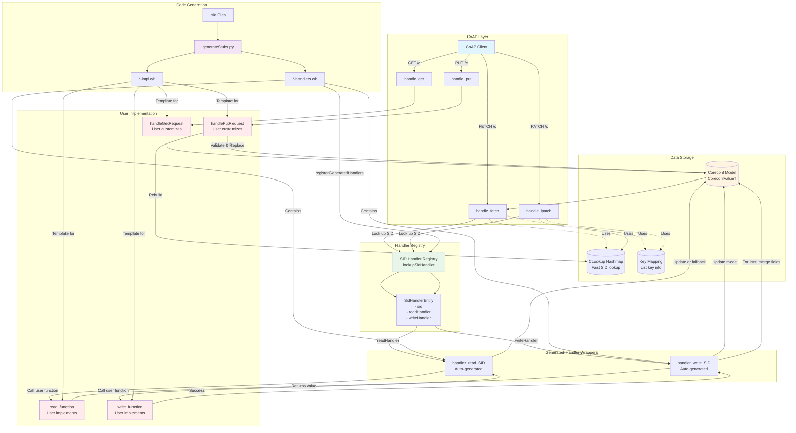

# CORECONF Handler Architecture

## Overview

The ccserver uses a layered architecture to handle CoAP requests and map them to YANG data model operations.

## Architecture Diagram

## Component Descriptions

### CoAP Layer
- **handle_get**: Returns entire model (or filtered subset via `handleGetRequest`)
- **handle_fetch**: Retrieves specific SIDs with keys
- **handle_put**: Replaces entire model after validation
- **handle_ipatch**: Partial updates of specific SIDs

### Handler Registry
- **SID Handler Registry**: Maps SIDs to their handler functions
- **SidHandlerEntry**: Contains read/write function pointers for each SID
- Populated during initialization by `registerGeneratedHandlers()`

### Generated Handler Wrappers
- **handler_read_SID**: Wrapper that calls user implementation and handles fallback
- **handler_write_SID**: Wrapper that calls user implementation and updates the model
- Automatically generated from .sid files by `generateStubs.py`
- Handles navigation to parent containers, key extraction, and model updates

### User Implementation
- **read_function**: User implements custom logic to read values
  - Can query hardware, read from system, etc.
  - Return NULL to fall back to model value
- **write_function**: User implements custom logic to write values
  - Can configure hardware, update system state, etc.
  - Return 0 on success, non-zero on error
- **handleGetRequest**: Customize GET response (default: return entire model)
- **handlePutRequest**: Customize PUT validation (default: validate top-level SID match)

### Data Storage
- **Coreconf Model**: In-memory hierarchical data structure
  - CoreconfValueT tree with hashmaps, arrays, and leaf values
  - Represents the current state of the YANG model
- **CLookup Hashmap**: Fast SID-to-path mapping for navigation
- **Key Mapping**: Metadata about list keys for list operations

### Code Generation
- **generateStubs.py**: Processes .sid files to generate:
  - Handler wrappers (*-handlers.c/h) - included in build
  - Implementation templates (*-impl.c/h) - user customizes
  - GET/PUT handler stubs in impl files

## Request Processing Flow

### FETCH Request (Read)
1. Client sends FETCH with array of SIDs/keys
2. `handle_fetch` parses CBOR payload
3. For each SID:
   - Look up handler in registry
   - If handler exists, call `handler_read_SID`
   - Handler calls user's `read_function`
   - If user returns NULL, fall back to model value
   - Otherwise use user's value
4. Collect all values and return CBOR array

### iPATCH Request (Write)
1. Client sends iPATCH with array of {SID: value} maps
2. `handle_ipatch` parses CBOR payload
3. For each SID:
   - Look up handler in registry
   - Call `handler_write_SID` with value
   - Handler extracts keys (for lists)
   - Handler calls user's `write_function`
   - If user returns 0 (success):
     - **For lists**: Merge value into existing entry (preserves other fields)
     - **For non-lists**: Update model with new value
4. Return success/failure

### PUT Request (Replace)
1. Client sends PUT with complete model
2. `handle_put` parses CBOR payload
3. Call `handlePutRequest`:
   - Validate both are hashmaps
   - Validate top-level SID match
   - User can add custom validation (return non-zero to reject)
   - Replace old model with new model
   - Rebuild CLookup hashmap
4. Return success/failure

### GET Request (Read All)
1. Client sends GET
2. `handle_get` calls `handleGetRequest(coreconfModel)`
3. User can filter/transform model (default: return entire model)
4. Serialize to CBOR and return

## Key Features

### List Entry Merging
When writing individual fields to a list entry, the handler **merges** the new fields into the existing entry instead of replacing it. This preserves other fields in the list entry.

Example:
- Existing: `{key: 1, field1: "a", field2: "b"}`
- Write: `{key: 1, field1: "x"}`
- Result: `{key: 1, field1: "x", field2: "b"}` ✓ (not `{key: 1, field1: "x"}`)

### Handler Customization
Users can customize behavior at multiple levels:
1. **Per-SID handlers**: Implement custom read/write logic for specific data nodes
2. **GET handler**: Filter or transform the entire model for GET requests
3. **PUT handler**: Add validation logic before accepting model replacement

### Fallback Behavior
Read handlers support graceful fallback:
- User handler returns actual value → use it
- User handler returns NULL → fall back to model value
- No handler registered → use model value

This allows incremental implementation where users only need to implement handlers for dynamic/hardware-backed values.
